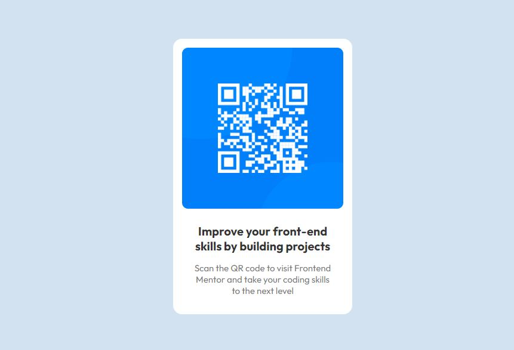

# Frontend Mentor - QR code component solution

This is a solution to the [QR code component challenge on Frontend Mentor](https://www.frontendmentor.io/challenges/qr-code-component-iux_sIO_H). Frontend Mentor challenges help you improve your coding skills by building realistic projects. 

## Table of contents

- [Overview](#overview)
  - [Screenshot](#screenshot)
  - [Links](#links)
- [My process](#my-process)
  - [Built with](#built-with)
  - [What I learned](#what-i-learned)
  - [Useful resources](#useful-resources)
- [Author](#author)

## Overview
- This activity was to create a responsive qr code in HTML and CSS, making sure it looks like the version in the lesson plan.

### Screenshot

### Links

- Solution URL: [Add solution URL here](https://github.com/dee101-101/getting-started-1/tree/main/qr-code-component-main)
- Live Site URL: [Add live site URL here](https://qr-code-dee101-101.netlify.app/)

### Built with

- Semantic HTML5 markup
- CSS custom properties
- Flexbox
- CSS Grid

### What I learned

This exercise was a great way for me to review CSS grid and flexbox as well as making code responsive.

### Useful resources

- [Centering in CSS Guide](https://css-tricks.com/centering-css-complete-guide/) - Helped me vertical align my container. Had everything algned horizontally, but after multiple attempts at aligning vertically using different methods, this article helped me. I was supposed to set the parent container to a grid and the child container margin to auto to align in the center verically. It worked perfectly.

## Author

- Frontend Mentor - [@dee101-101](https://www.frontendmentor.io/profile/dee101-101)
